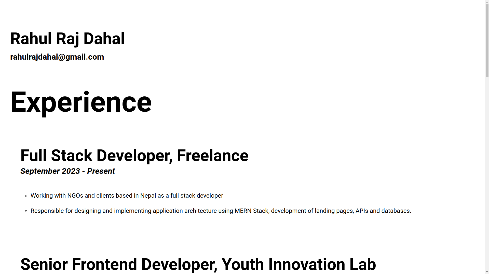

# [CV](https://github.com/rahulrajdahal/CV). CV

## Preview

[](https://github.com/rahulrajdahal/CV)

## 🏗 Development Guide

### 1. clone the repository

```sh
git clone https://github.com/rahulrajdahal/CV.git
```

### 2. Open index.html

#### OR

### 2. Open with live server

## 🚀 Project Structure

Inside of project [CV](https://github.com/rahulrajdahal/CV), you'll see the following folders and files:

```text
/
├── images/
│   └── rahul.png
├── screenshots/
│   └── screenshot.png
├── index.html
├── styles.css
└── README.md
```
